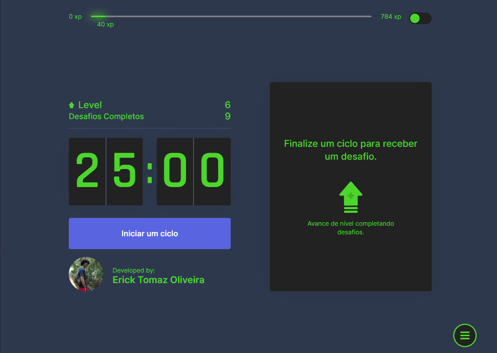
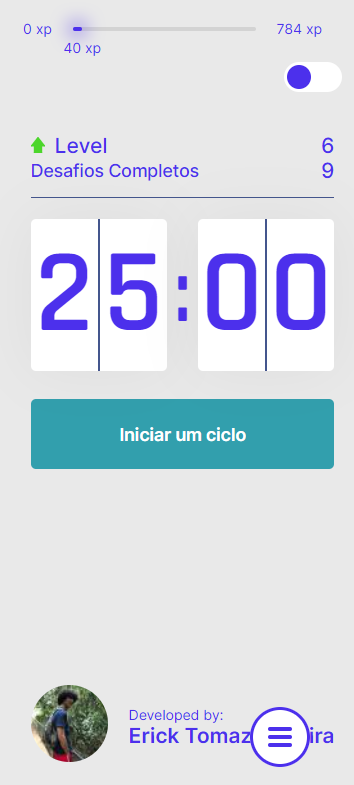

# Movit

A pomodoro app with support to personalized challenges.

## Build with

- Next
- Styled-components
- Typescript
- Next-i18next

## Author

- Linkedin - [@erick-t-oliveira](https://www.linkedin.com/in/erick-t-oliveira/)
- Github - [Erick_Tomaz_ET](https://github.com/Erick-Oliveira-ET)
- Frontend Mentor - [@Erick-Oliveira-ET](https://www.frontendmentor.io/profile/Erick-Oliveira-ET)
- Instagram - [@erick_tomaz_kz](https://www.instagram.com/erick_tomaz_kz/)

## History

This is a project developed in a really good brazilian coding camp named Next Level Week. I've been a part of 5 of them and learn something new in every one of them. But the NLW4 is an exception. Usually the projects aren't very useful for me, the developer but this one I started to use a lot.

The idea is simple: a simple pomodoro app that gives challenges to the user, specially programmers, move, stretch and take breaks to improve performance and avoid health problems. The first week using it I changed changing the challenges to make calisthenic exercises because I needed to exercise more because of quarantine and it made so much difference in all aspects. I guess my body saw me doing spaced and more heavy exercises during the day and I gain muscles quickly.

After that I remembered a conversation that I had with a friend and she told me that she wanted to stretch more (she's a dancer). So I made the worst decision and cloned the exact same project and changed the colors (she likes light mode in everything, even discord. It's crazy) and the challenges.

A few days past this I realized the stupid decision I've made and started to improve the website. First I code refactored it because the timer logics didn't work when the tab was in sleep mode and so the countdown never did the job and also because the challenges were randomly selected and that's not good since the same challenge could appear multiple in a row. After that I changed all CSS code to styled-components because I wanted to learn the library and I never stopped using it. Made a theme changer because of my friend. And I made a way for people to add, remove and edit the challenges for anyone with different goals.

Nowadays I use it as a way to test new libraries and technics that I want to learn as multiple languages support and server side rendering.
